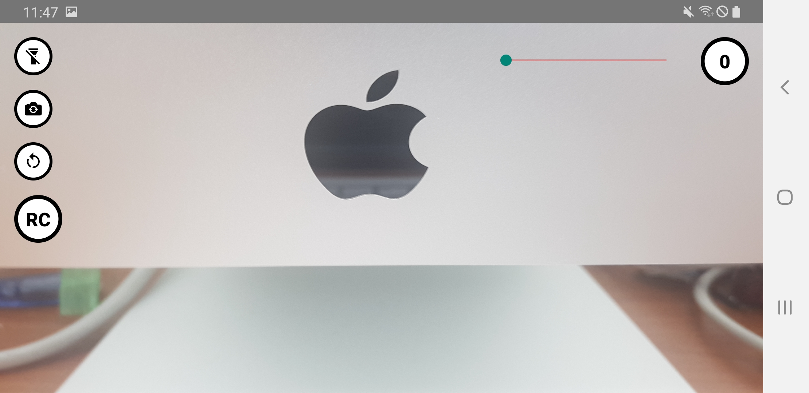

# 📤 Water AI Camera (2022) (실무 프로젝트)

  
  

---

### 🎯 주요 기능

- 디바이스 위치 기반 자동 녹화 기능
- 카메라 제어 및 루프 레코딩
- 서버에서 전달된 값으로 줌/녹화시간 등 동적 제어 가능
- `react-native-device-info`, `camera`, `location` 등 다양한 네이티브 기능 활용

---

### 🛠 기술 스택

| 항목        | 내용                     |
| ----------- | ------------------------ |
| 프레임워크  | **React Native**         |
| 내비게이션  | **React Navigation**     |
| 카메라 기능 | **Camera API**           |
| HTTP 통신   | **Axios**                |
| 녹화 로직   | Loop Recording Logic     |
| 자동 트리거 | Auto Trigger (조건 기반) |
| UI 구성     | Custom Component UI      |

---

### 🧱 개발 후기

- CCTV 없이 실시간 상황을 자동으로 녹화할 수 있는 앱 설계
- 녹화 기준값 및 사용자 설정을 서버에서 받아서 동적으로 반영
- iOS/Android 양쪽에 맞춘 크로스 플랫폼 UI 구현
