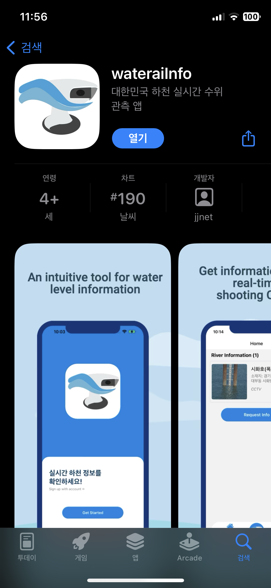
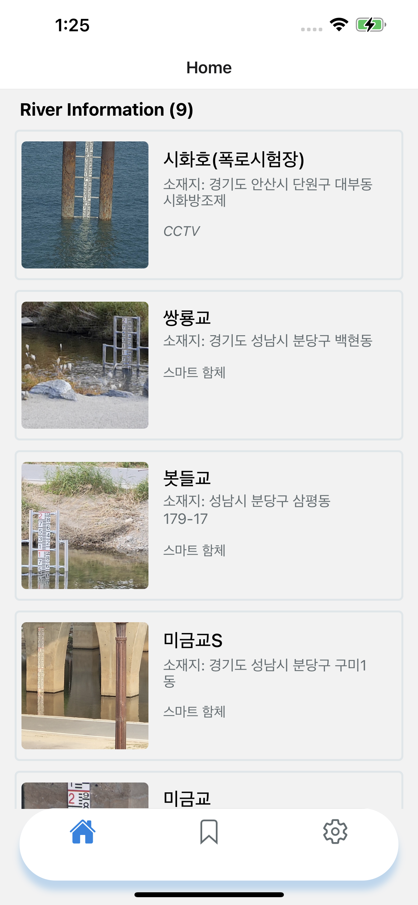
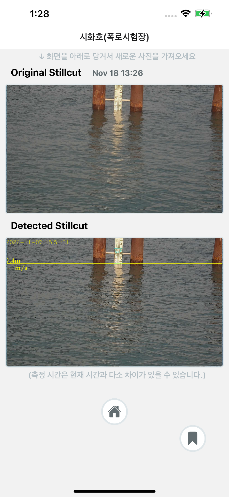

# 📤 [React Native] Water AI Info (2022)

---

### 📱 About

> **대한민국 하천의 수위 관측 데이터를 실시간으로 조회하고 저장하는 앱**

- 사용자가 촬영한 수위 영상을 업로드하여 수위를 자동 검출
- 저장된 데이터는 서버로 전송되며, 각 하천별로 리스트 및 디테일 조회 가능
- 게스트 모드와 사용자 인증 기반 접근 지원

---

### 🔗 Download

| 플랫폼         | 링크                                                                                   |
| -------------- | -------------------------------------------------------------------------------------- |
| 🛒 App Store   | [wateraiInfo (iOS)](https://apps.apple.com/kr/app/wateraiinfo/id6444245568)            |
| 📦 Google Play | [wateraiInfo (Android)](https://play.google.com/store/apps/details?id=com.wateraiinfo) |

---

### 🖼 Screenshots

<div align="center">
  
  
  
</div>

---

### ✨ 주요 기능

- 사용자 로그인/회원가입/탈퇴 (JWT 기반 인증)
- 비회원(게스트) 모드로 콘텐츠 조회
- 영상 업로드 후 자동 수위 검출 기능
- 하천 리스트, 세부 정보, 자동 캡처 이미지 및 수위 정보 제공
- 즐겨찾기(북마크) 기능 지원 (유저-하천 N:M)

---

### 💻 Example

```tsx
// App.js

const App = () => {
  const [loginState, dispatch] = React.useReducer(
    loginReducer,
    initialLoginState
  );

  const authContext = React.useMemo(
    () => ({
      signIn: async (props) => {
        const res = await axios.post(`${BASE_URL}/api`, props);
        if (res?.data?.ok) {
          dispatch({ type: "REGISTER", userToken: res.data.token });
        }
      },
    }),
    []
  );

  return (
    <AuthContext.Provider value={authContext}>
      <NavigationContainer>
        <NativeStack.Navigator screenOptions={{ headerShown: false }}>
          {loginState.userToken === null ? (
            <NativeStack.Screen name="Stack" component={Stack} />
          ) : (
            <>
              <NativeStack.Screen name="Tab" component={Tab} />
              <NativeStack.Screen name="DetailStack" component={DetailStack} />
            </>
          )}
        </NativeStack.Navigator>
      </NavigationContainer>
    </AuthContext.Provider>
  );
};
```

---

### 🛠️ 기술 스택

| 구분           | 기술/도구                               |
| -------------- | --------------------------------------- |
| 프레임워크     | **React Native**                        |
| 내비게이션     | **React Navigation**                    |
| HTTP 통신      | **Axios**                               |
| 상태 관리/저장 | **AsyncStorage**                        |
| 인증 방식      | **JWT 토큰 기반 인증**                  |
| 기타 기능      | FlatList, SplashScreen, Module Resolver |
| 대응 플랫폼    | ✅ iOS / ✅ Android                     |

---

### 🧱 개발 후기

- 🎨 **UI/UX 디자인부터 전체 구현까지 단독 진행**
- 🔐 **로그인/회원가입/탈퇴 기능 구현 및 JWT 인증 연동**
- ☑️ **Google Play Store 1차 등록 완료**
- 🚫 **App Store는 10회 반려 → 게스트 모드 등 추가 기능 반영 후 최종 승인**
- ⭐ **즐겨찾기 기능 구현 시 DB의 N:M 관계 구조 설계 및 반영**
- 🧪 **TestFlight / Google Play Console을 통한 사전 테스트 완료**

---
