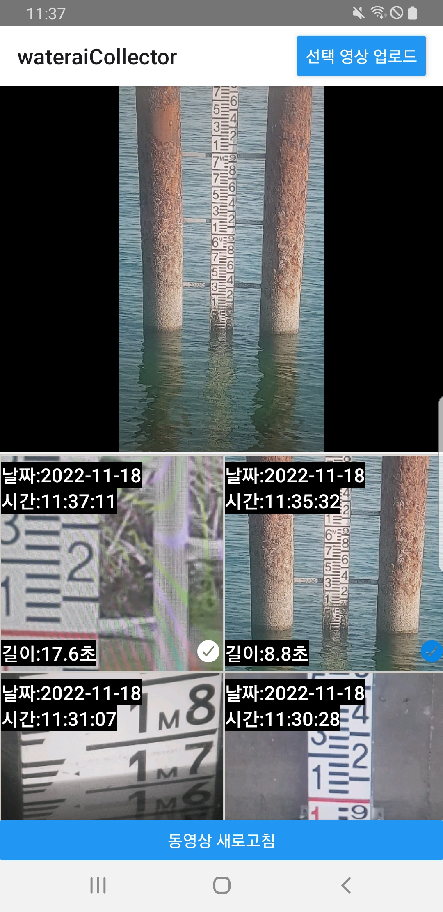
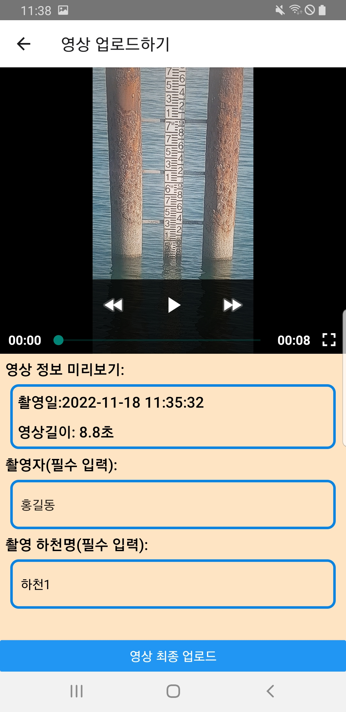

# 📤 Water AI Uploader (2022) (실무 프로젝트)

> 사용자가 영상 파일을 선택하고 정보를 입력한 뒤 업로드할 수 있도록 구성된 React Native 기반의 앱입니다.

---

## 📱 주요 기능

- **영상 목록 및 썸네일 미리보기**

  - 촬영 날짜, 시간, 영상 길이를 자동으로 추출해 카드 형태로 표시
  - 체크 표시로 영상 선택 가능

- **영상 업로드 화면**
  - 선택한 영상의 미리보기 제공 (플레이 가능)
  - 촬영자, 하천명 필수 입력 필드
  - "영상 최종 업로드" 버튼을 통한 데이터 전송

---

## 🖼️ 주요 화면

### 1. 영상 선택 화면

- 날짜/시간/영상 길이 표기
- 여러 영상 썸네일을 한 번에 시각적으로 확인 가능
- 선택한 영상 우측 하단에 체크 표시

---

### 2. 업로드 입력 폼 화면

- 선택한 영상 미리보기 + 재생 가능
- 입력폼: 촬영일자, 영상 길이 자동 세팅
- 사용자 입력: 촬영자, 하천명 필수값

---

## ⚙️ 사용 기술 스택

| 항목        | 내용                                                             |
| ----------- | ---------------------------------------------------------------- |
| 프레임워크  | React Native                                                     |
| 상태관리    | useState, useEffect                                              |
| 네트워크    | Apollo Client                                                    |
| 폼 처리     | React Hook Form (`useForm`)                                      |
| 파일 업로드 | ReactNativeFile + `formData` 사용                                |
| 네비게이션  | `@react-navigation/native` with `setOptions`, `navigation props` |

---

## 🔍 비고

- 업로드 및 입력 로직을 구성한 프로젝트입니다.
- React Native에서 파일 선택 및 업로드 흐름을 설계하고 Apollo를 통한 전송까지 구현했습니다.
