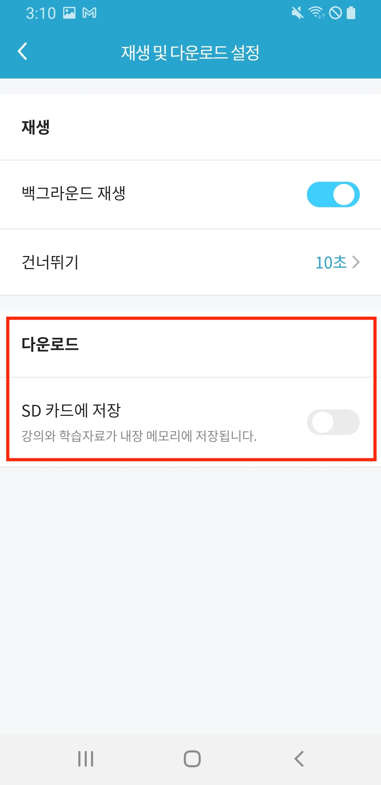
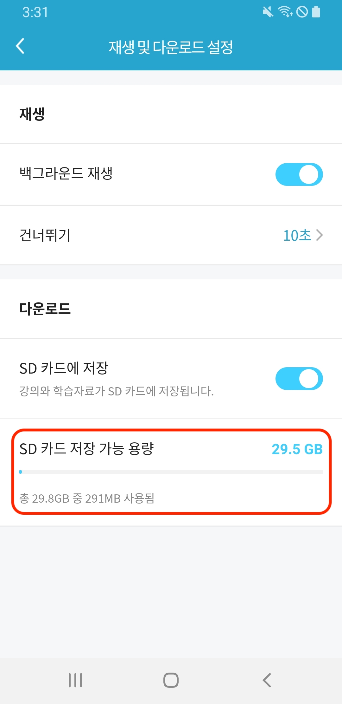
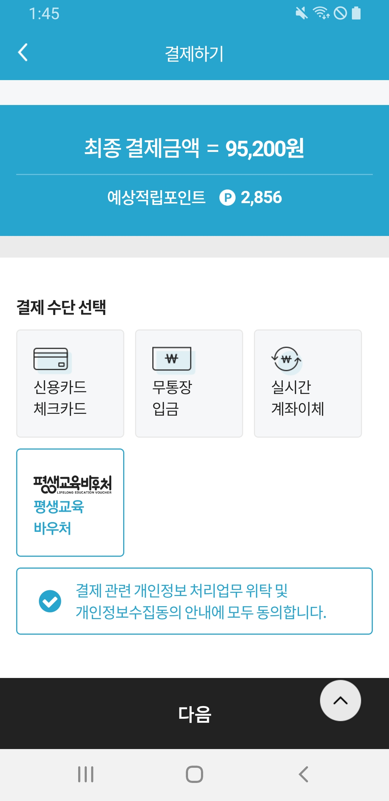

# 해커스ONE (2023)

> React Native 기반 iOS & Android 학습 앱  
> [App Store에서 보기](https://apps.apple.com/kr/app/%ED%95%B4%EC%BB%A4%EC%8A%A4-one-%EC%8A%A4%EB%A7%88%ED%8A%B8-%ED%81%B4%EB%9E%98%EC%8A%A4/id1538534916)

---

## 📌 주요 기능 (Features)

### 1. 백그라운드 재생 및 다운로드 설정

- **백그라운드 재생 지원**

  - 학습 콘텐츠를 앱을 벗어나도 계속 들을 수 있도록 설정 가능

- **건너뛰기 간격 조정**

  - 사용자가 원하는 단위(예: 10초)로 설정

- **SD 카드 저장 기능**
  - SD 카드가 연결되어 있을 경우 다운로드 위치를 SD 카드로 변경 가능
  - 총 용량 및 사용 용량 확인 가능

📷 설정 화면 예시

---

### 2. 결제 기능

- **결제 수단 선택 가능**
  - 신용카드/체크카드, 무통장 입금, 실시간 계좌이체, 평생교육바우처 지원
- **예상 적립 포인트 표시**
- **개인정보 수집 및 결제 동의 안내 포함**

📷 결제 화면 예시

---

## 🛠️ 기술 스택

- **React Native**
- **TypeScript**
- **Android / iOS 호환성 대응**
- 상태 관리, 백그라운드 재생 및 SD 카드 파일 시스템 관련 커스텀 기능 구현 포함

---

## 📝 비고

- 프로젝트에 직접적인 영향을 줄 수 있는 주요 코드는 제외되었습니다.
