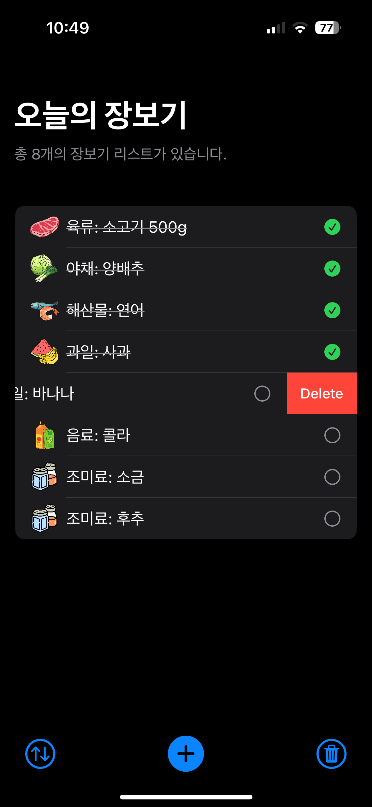
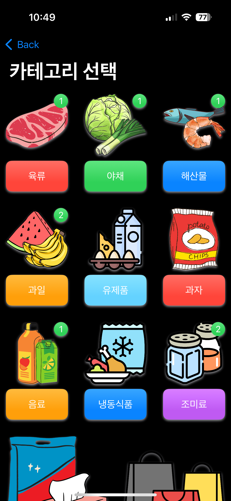
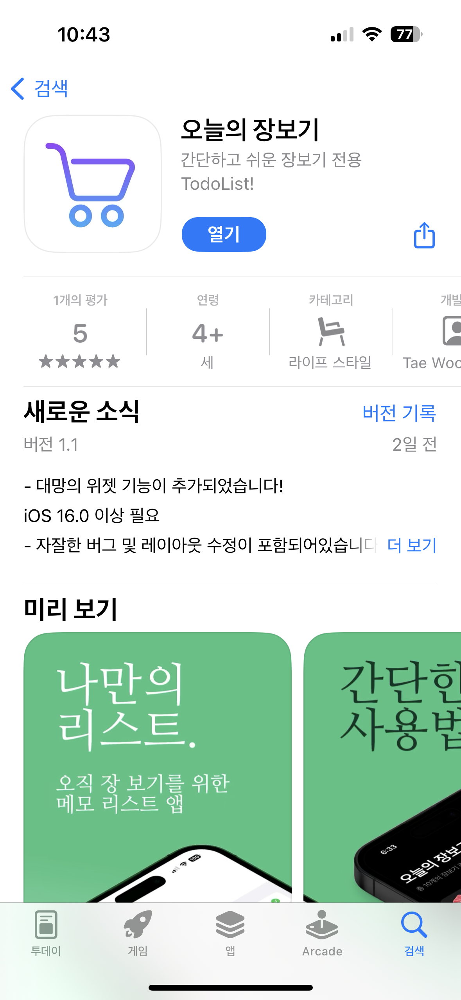

# 🛒 오늘의 장보기 (2024)

간단하고 직관적인 장보기 전용 리스트 앱  
[앱스토어 바로가기 →](https://apps.apple.com/kr/app/%EC%98%A4%EB%8A%98%EC%9D%98-%EC%9E%A5%EB%B3%B4%EA%B8%B0/id6472140588)

---

## 📝 프로젝트 소개

**오늘의 장보기**는 메모 앱이나 일반 TODO 앱보다 훨씬 직관적이고  
장보기 특화된 방식으로 품목을 관리할 수 있는 앱입니다.  
카테고리별 품목 추가, 체크, 삭제, 정렬 등 장보기에 최적화된  
기능만 담아 누구나 빠르게 사용할 수 있습니다.  
iOS 16 이상의 버전에서는 위젯으로도 확인이 가능합니다.

---

## ✨ 주요 기능

- **🧾 카테고리별 품목 선택**

  - 육류, 채소, 해산물, 과일 등으로 시각적 분류
  - 선택 시 자동으로 리스트에 추가

- **✅ 직관적인 체크 기능**

  - 체크한 품목은 취소선으로 표시되고 정렬 가능

- **🧹 슬라이드 삭제 기능**

  - 리스트에서 품목을 손쉽게 삭제 가능

- **🔀 리스트 정렬**

  - 체크 항목을 자동으로 아래로 이동

- **📱 대망의 위젯 지원**
  - 홈 화면에서 바로 장보기 리스트를 확인 가능

---

## 🛠️ 사용 기술 스택

| 항목              | 내용                                      |
| ----------------- | ----------------------------------------- |
| **개발 언어**     | Swift                                     |
| **UI 프레임워크** | SwiftUI                                   |
| **상태 관리**     | MVVM 패턴 기반 로직 분리                  |
| **데이터 저장**   | UserDefaults 기반 로컬 저장               |
| **위젯 연동**     | 앱 ↔ 위젯 간 App Group 활용한 데이터 공유 |
| **기타 특징**     | Onboarding 화면 / Property Wrappers 활용  |

---

## 💡 기술적 특징

- **SwiftUI 기반의 유연한 UI 구현**
  → ViewModel을 활용한 MVVM 구조로 화면 구성 및 데이터 관리

- **UserDefaults를 통한 로컬 스토리지 관리**
  → 서버 없이도 앱과 위젯 간 동일한 데이터를 유지

- **재사용성과 유지보수를 고려한 구조 설계**
  → Property Wrappers, 명확한 컴포넌트 분리, 클린 코드 구현

- **위젯 연동 기능**
  → 위젯Kit을 활용한 iOS 홈 화면 위젯 표시 기능 구현 (iOS 16 이상)

---

## 📱 주요 화면 미리보기

### 장보기 메인 화면 - 리스트 체크/삭제/정렬

### 카테고리별 품목 추가 화면

### iOS 홈 위젯 화면 (미리보기)

---

## 🙋🏻‍♂️ 기여 및 역할

- 앱 기획 및 UX 설계 전반 주도
- SwiftUI 기반 앱 전체 구현
- MVVM 구조 설계 및 재사용 가능한 컴포넌트 개발
- Onboarding, 위젯 연동 등 부가 기능 개발
- 앱스토어 등록, 심사 대응 및 버전 관리

---

## ✅ 배포 정보

- 📱 [App Store에서 확인하기](https://apps.apple.com/kr/app/%EC%98%A4%EB%8A%98%EC%9D%98-%EC%9E%A5%EB%B3%B4%EA%B8%B0/id6472140588)
- 📅 출시일: 2024년 출시
- 📦 버전: 1.1 (최근 업데이트: 위젯 기능 추가 및 UI 개선)
