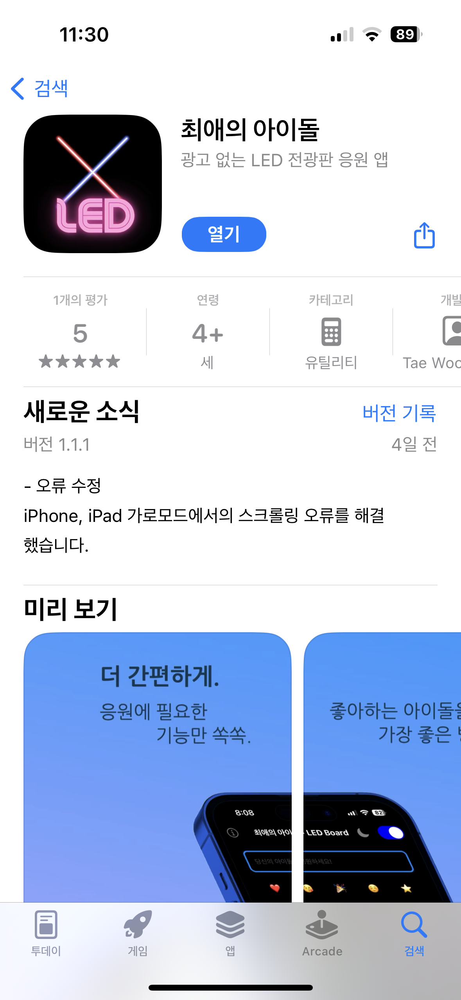
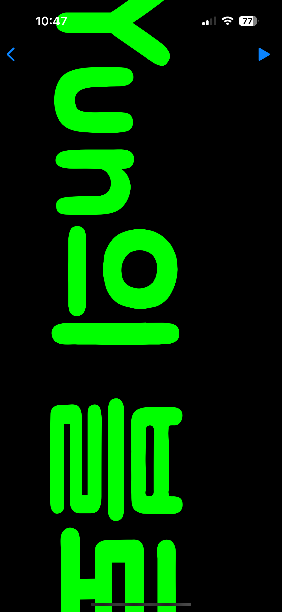
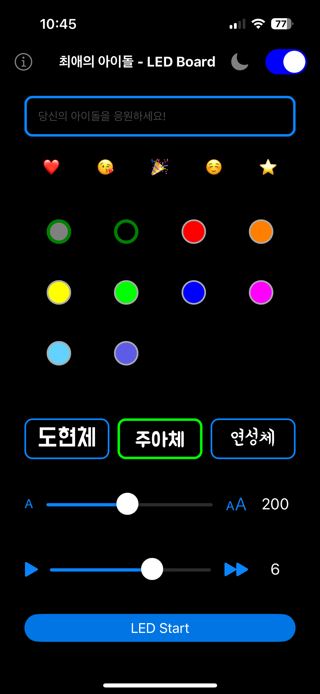

# 💡 최애의 아이돌 - LED 전광판 (2024)

📱 광고 없이 간편한 아이돌 응원용 LED 전광판 앱  
[앱스토어 바로가기 →](https://apps.apple.com/kr/app/%EC%B5%9C%EC%95%A0%EC%9D%98-%EC%95%84%EC%9D%B4%EB%8F%8C/id6470147565)

---

## 📝 프로젝트 소개

**최애의 아이돌**은 콘서트, 팬미팅, 팬싸인회 등에서  
응원 메시지를 강렬하게 보여줄 수 있도록 도와주는 LED 전광판 앱입니다.  
광고 없는 깔끔한 구성과 쉬운 조작으로 누구나 손쉽게 사용할 수 있으며,  
다양한 커스터마이징 기능을 통해 응원 메시지를 개성 있게 연출할 수 있습니다.

---

## ✨ 주요 기능

- **🎉 다크/라이트 모드 전환 지원**

  - 토글 스위치를 통해 손쉽게 테마 변경 가능

- **📌 이모지 빠른 추가 기능**

  - 자주 쓰는 이모지를 한 번에 추가 가능

- **🎨 색상 선택 및 교차 효과**

  - 하나 선택 시 단색, 두 개 선택 시 교차 색상 지원

- **🔤 폰트 스타일 및 크기 조절**

  - 배민체(도현체, 주아체, 연성체) 및 iOS 기본 폰트 제공
  - 글자 크기와 스크롤 속도 자유 조절

- **⏸ 스크롤 일시 정지/재시작**

  - 원하는 타이밍에 스크롤을 정지 및 재시작 가능

- **ℹ️ 직관적인 사용법 안내**
  - 좌측 상단 i 버튼으로 각 기능에 대한 설명 제공

---

## 🛠️ 사용 기술 스택

| 항목                | 내용                                                                    |
| ------------------- | ----------------------------------------------------------------------- |
| **개발 언어**       | Swift                                                                   |
| **UI 프레임워크**   | UIKit                                                                   |
| **레이아웃**        | AutoLayout 적용                                                         |
| **주요 기능**       | Scrolling 애니메이션, 다크모드, 색상 교차, CollectionView               |
| **외부 라이브러리** | [`Instructions`](https://github.com/ephread/Instructions) 튜토리얼 안내 |

---

## 💡 기술적 특징

- **UIKit 기반 사용자 인터페이스**
  → 직관적인 컴포넌트 구조와 AutoLayout 기반 반응형 UI 설계

- **Instructions 라이브러리 도입**
  → 초보자도 쉽게 사용할 수 있도록 단계별 기능 설명 제공

- **애니메이션 기반 스크롤 구현**
  → 텍스트가 자동으로 좌우 혹은 상하 스크롤되며, 멈춤/재시작 제어 가능

- **색상/폰트/속도 커스터마이징**
  → 사용자 기호에 맞춘 디테일한 조정 가능

---

## 📱 주요 화면 미리보기

### 메인 화면 - 메시지 작성 및 설정

### 전광판 실행 화면 - 스크롤링 응원 메시지

---

## 🙋🏻‍♂️ 기여 및 역할

- 기획 및 UI 디자인
- Swift 기반 앱 전체 개발
- LED 전광판 애니메이션 스크롤 로직 구현
- 다크모드, 컬러 설정, 사용자 인터랙션 기능 설계
- App Store 등록 및 배포 진행

---

## ✅ 배포 정보

- 📱 [App Store에서 확인하기](https://apps.apple.com/kr/app/%EC%B5%9C%EC%95%A0%EC%9D%98-%EC%95%84%EC%9D%B4%EB%8F%8C/id6470147565)
- 📅 출시일: 2024년 출시
- 📦 버전: 1.1.1 (최근 업데이트: 가로모드 스크롤 오류 수정)
