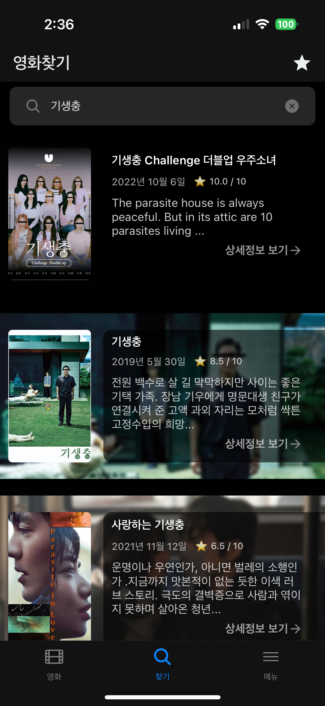
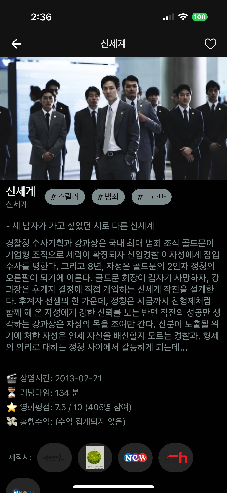
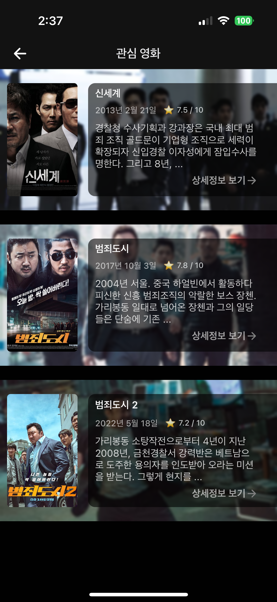

# 🎬 World Movie (월드무비) (2023)

📱 React Native 기반 iOS & Android 영화 정보 앱  
[앱스토어 바로가기 →](https://apps.apple.com/kr/app/%EC%9B%94%EB%93%9C%EB%AC%B4%EB%B9%84/id6473882514)

---

## 📝 프로젝트 소개

월드무비는 최신 개봉작부터 고전 명작까지 다양한 영화를 탐색하고,  
관심 있는 영화를 찜해 관리할 수 있는 정보 제공 앱입니다.  
Firebase를 기반으로 사용자 인증 및 영화 찜 기능을 제공하며,  
외부 영화 API를 통해 실시간 데이터를 연동합니다.

> ⚠️ 일부 민감하거나 프로젝트에 직접적인 영향을 주는 코드는 제외했습니다.

---

## ✨ 주요 기능

- **📍 실시간 영화 목록 조회**

  - 현재 상영작, 인기 차트, 극찬 영화 등 다양한 필터 제공
  - 정렬 및 검색 기능 지원

- **🔍 영화 검색**

  - 키워드 기반 다중 결과 탐색
  - 상세 페이지 진입 후 줄거리, 평점, 태그 확인 가능

- **📌 찜하기 및 관심 목록**

  - Firebase 기반 사용자 맞춤 관심 영화 저장
  - '관심 영화' 탭에서 한눈에 관리 가능

- **🔐 사용자 인증 및 보안**
  - Firebase Auth 사용
  - 로그인/로그아웃, 비밀번호 재설정, 회원 탈퇴 기능 지원

---

## 🛠️ 사용 기술 스택

| 항목            | 내용                       |
| --------------- | -------------------------- |
| **프레임워크**  | React Native               |
| **언어**        | TypeScript                 |
| **상태관리**    | Zustand                    |
| **인증 및 DB**  | Firebase (Auth, Firestore) |
| **비동기 처리** | async/await, fetch         |
| **스타일링**    | React Native StyleSheet    |
| **배포**        | App Store & Play Store     |

---

## 💡 기술적 특징

- **Zustand로 전역 상태 관리 구현**  
  → 인증 정보 및 찜 목록을 전역으로 공유하고, 퍼포먼스를 고려한 구조로 설계.

- **Firebase Auth + Firestore를 이용한 백엔드 대체**  
  → 별도 서버 없이 사용자 정보, 관심 영화 데이터를 실시간 저장/조회.

- **Promise + async-await 기반 에러 처리**  
  → 네트워크 오류나 예외 상황에 대응하여 안정적인 UX 제공.

- **TypeScript 기반으로 안전한 타입 시스템 적용**  
  → 컴파일 단계에서의 오류 방지 및 유지보수성 향상.

---

## 📱 주요 화면 미리보기

### 홈 화면 - 현재상영작 및 카테고리별 탐색

### 영화 검색 및 키워드 결과

### 상세 정보 페이지

### 관심 영화 목록

---

## 🙋🏻‍♂️ 기여 및 역할

- 기획 및 디자인 전체 참여
- Firebase 연동, API 통신, 상태관리 구조 설계
- iOS/Android 동시 배포 및 마켓 심사 대응

---

## ✅ 배포 정보

- 📱 [App Store에서 확인하기](https://apps.apple.com/kr/app/%EC%9B%94%EB%93%9C%EB%AC%B4%EB%B9%84/id6473882514)
- 📅 출시일: 2023년 11월
