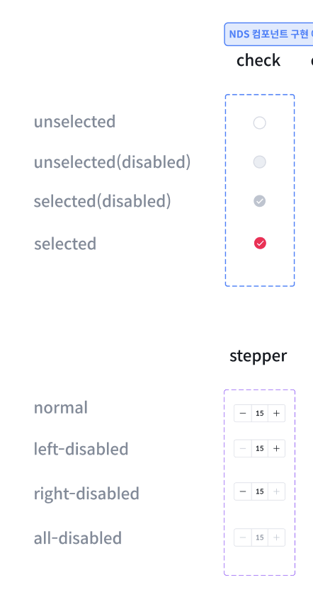
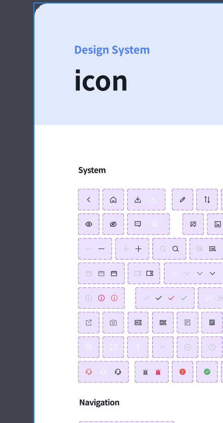
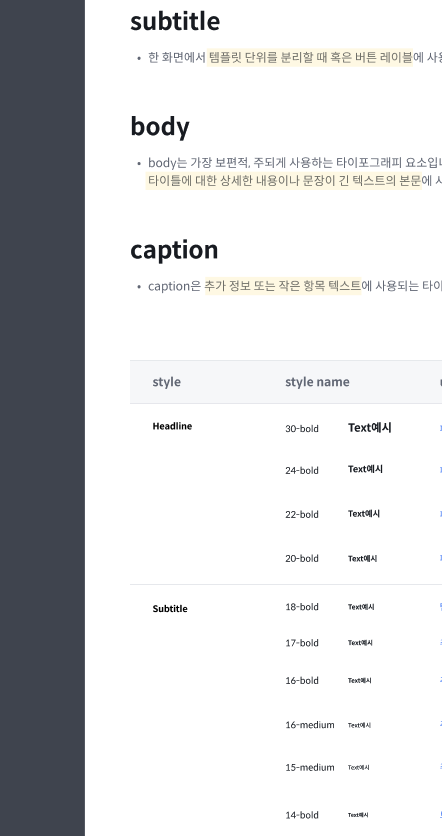
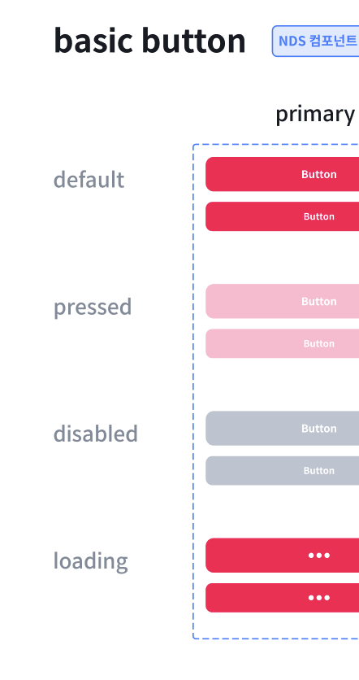

# 🎨 NDS - 니콘내콘 Design System (실무 프로젝트)

공통 UI 가이드와 컴포넌트를 통합 관리하는 디자인 시스템 (모노레포 기반)

---

## 📝 소개

**NDS (니콘내콘 Design System)**는 니콘내콘 서비스 전반에 걸쳐  
UI 일관성을 유지하고 컴포넌트 재사용성을 높이기 위해 구축된 디자인 시스템입니다.  
버튼, 체크박스, 아이콘, 타이포그래피 등등 다양한 UI 요소를 공통 규격으로 정의합니다.
React Native 앱을 비롯한 웹뷰, 내부 시스템 웹 등 회사의 모든 플랫폼에서 사용할 수 있도록 구축되었습니다.

---

## 🛠️ 기술 스펙

| 항목              | 내용                                                                 |
| ----------------- | -------------------------------------------------------------------- |
| **설명**          | 니콘내콘 디자인 시스템(NDS)을 구성하는 모노레포 프로젝트             |
| **언어**          | TypeScript                                                           |
| **패키지 매니저** | Bun                                                                  |
| **모노레포 도구** | Turborepo (`turbo`)                                                  |
| **워크스페이스**  | `"packages/*"` 경로 하위 패키지 구성                                 |
| **코드 스타일**   | ESlint + Prettier                                                    |
| **릴리즈 관리**   | Changesets (`@changesets/cli`) 기반 커밋/버전/배포 자동화 관리       |
| **형상관리 방식** | Git + Changeset 기반 배포 브랜치 정책 (`master`, PR, Release Action) |

---

## ✅ 적용 목적

- **디자인 통일성 확보**: 기능별 시각 일관성 유지
- **개발 생산성 향상**: 재사용 가능한 UI 컴포넌트 제공
- **유지보수 용이성**: 버전 관리 및 전사 기준 정의 가능
- **프로젝트 확장성**: 다양한 플랫폼에 적용 가능
- **디자이너와 개발자의 협업 효율화**: 디자이너와 개발자가 소통하기 쉬운 환경 제공

---

## 💡 컴포넌트 구성 (일부)

### ✅ Check & Stepper

- **Check**: 선택/비선택/비활성 상태 지원
- **Stepper**: 증감 조절 UI, 좌측/우측 비활성 등 다양한 상태 제공

---

### 🔤 Typography

- **Headline**: 30~20 bold까지 4단계
- **Subtitle**: 18~14pt, medium~bold
- **Body / Caption**: 본문 및 부가정보용 텍스트 스타일 정의

---

### 🧭 Icon

- 시스템 아이콘, 내비게이션 아이콘, 상태 아이콘 등으로 분류
- 사용 목적에 따라 크기, 색상, 선두께가 일관되도록 설계

---

### 🟥 Button

- 기본 버튼 제공
- 상태별 시각 스타일:
  - `default`
  - `pressed`
  - `disabled`
  - `loading`

---
