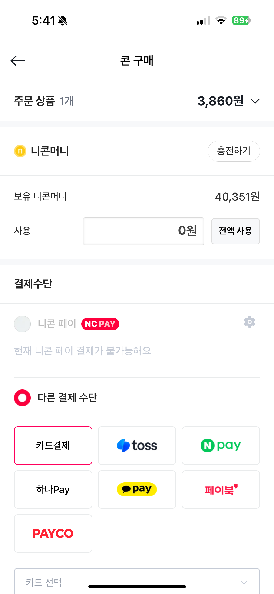
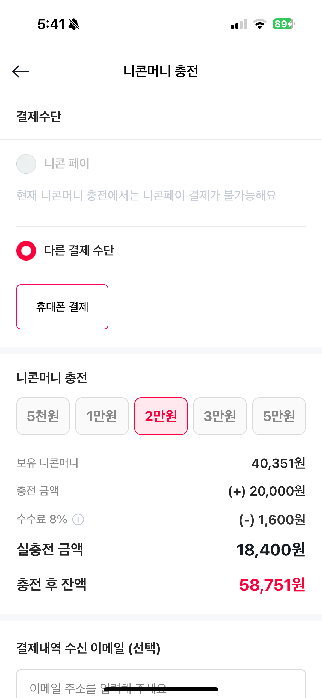

# 💳 ncnc-payment - 니콘내콘 결제 웹뷰 (실무 프로젝트)

앱 내 콘 구매 및 결제 과정을 처리하는 WebView 기반 결제 모듈

---

## 📝 소개

**ncnc-payment**는 니콘내콘 사용자들이 앱 내에서 콘(상품권)을 쉽고 빠르게 구매할 수 있도록 설계된  
**Next.js 기반의 결제 WebView 프로젝트**입니다.  
결제 흐름 전반(주문 조회, 결제 진행, 실패 처리, 성공 처리)을 안정적으로 처리하며,  
다양한 결제 수단과 상태에 따라 UX가 유연하게 대응하도록 구현되었습니다.

---

## 🛠️ 기술 스펙

| 항목              | 내용                                                      |
| ----------------- | --------------------------------------------------------- |
| **프로젝트 설명** | 니콘내콘 콘 상품 결제 WebView 페이지                      |
| **프레임워크**    | Next.js (Page Router)                                     |
| **언어**          | TypeScript                                                |
| **상태 관리**     | Recoil                                                    |
| **데이터 패칭**   | React Query                                               |
| **스타일링**      | Emotion + NDS 디자인 시스템                               |
| **이벤트 트래킹** | Amplitude 이벤트 로깅                                     |
| **Native 연동**   | React Native WebView postMessage 기반 Native <-> Web 통신 |

---

## ✅ 적용 목적

- **앱 내 결제 UX 강화**: React Native 앱과 연동된 안정적 결제 흐름 제공
- **비즈니스 유연성 확보**: 프로모션, 리워드, 니콘페이 등 다양한 로직 유연 대응
- **결제 실패 처리 개선**: 타임아웃, iOS 버전 제한, 주문 만료 등 방어 로직 구현
- **Amplitude 연동 분석**: 구매 퍼널 분석을 위한 상세 이벤트 수집
- **사용자 친화적 메시지**: 결제 성공/실패 페이지 UX 강화 및 설명 제공

---

## 🧾 주요 페이지 구성

### ✅ `order/[orderId].tsx` - 결제 페이지 (콘 주문)

- 주문 정보 및 유저 상태 확인
- iOS 버전 체크 및 제한 대응
- 니콘페이 사용 여부 및 UI 제어
- `ConOrderInfo`, `PaymentMethods`, `SpendNiconMoney` 등 핵심 UI 모듈 배치
- `beforeRemove` 커스텀 이벤트로 이탈 방지 처리
- 이벤트 로깅: `viewed order`, `viewed cart order`

---

### 🔁 `order/relay.tsx` - 결제 중 중계 페이지

- 결제 요청 → 완료까지 대기 상태 표현
- 사용자에게 “최대 1분 소요” 메시지 전달
- `Loading` 컴포넌트로 깔끔한 UX 제공

---

### ❌ `order/cancel.tsx` - 결제 실패 페이지

- 타임아웃 또는 유저 중단 시 유입
- 실패 사유 `message` 쿼리로 전달받아 alert 처리
- "다시 주문" / "닫기" 버튼으로 분기 UX 제공
- Amplitude 이벤트: `viewed failed buy`, `viewed failed cart buy`

---

### ✅ `purchased/[orderId].tsx` - 결제 완료/실패 결과 페이지

- 소켓 + polling 기반 주문 결과 수신
- 성공/실패/대기 상태에 따른 메시지 분기
- 리워드 지급 조건 시 안내 버튼 제공
- Amplitude 이벤트: `viewed checkout buy`, `viewed checkout cart buy`

---

## 📲 Native 연동 구조

- `postMessage('goBack')`, `postMessage('goScreen')` 등 메시지 기반 Web ↔ Native 연동
- 앱 상태 (`currentAppStatus`) 에 따라 결제 제한 or 자동 이동 처리
- Native 전용 이벤트 (`beforeRemove`, `backHandler`, `loadDataFromStorage`) 구현

---

## 💡 유저 경험 강화 포인트

- iOS 버전이 낮을 경우 결제 차단 및 안내 → 사용자 CS 감소
- 결제 실패 시 적절한 안내문구 & 액션 제공 → 이탈률 방지
- 앱 종료/이탈 방지 팝업 → 결제 중단 가능성 최소화
- 결제 성공 시 BenefitButton 표시 → 리워드 CTA 강조
