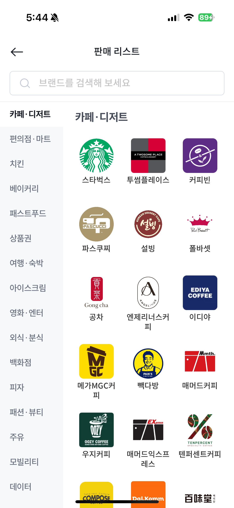
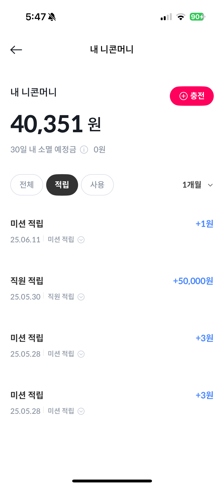

# 📱 니콘내콘 앱 개발 기술 정리 (실무 프로젝트)

MAU 30만 기프티콘 거래 서비스

---

## 📝 소개

**니콘내콘**은 모바일 상품권(기프티콘) 거래를 지원하는 통합 커머스 플랫폼입니다.
React Native + TypeScript 기반으로 크로스 플랫폼을 지원하며, 안정적인 커머스 UX를 위해 네이티브 기능 연동, 상태 관리, 고속 스토리지 등을 유기적으로 통합하였습니다.

딥링크 진입, 밝기 조절 및 사진 접근과 같은 네이티브 기능 연동, 쿠폰의 판매·환불·정산 상태 관리 등 실제 사용자 흐름을 중심으로 앱 구조가 구성되어 있습니다.

Recoil과 React Query를 통한 안정적인 상태 관리, MMKV 기반 고속 스토리지, Emotion과 StyleSheet를 병행한 유연한 스타일링 시스템을 활용해
신뢰도 높은 커머스 경험과 우수한 성능을 동시에 구현했습니다.

---

## 🔧 기술 스택

| 항목              | 내용                                                           |
| ----------------- | -------------------------------------------------------------- |
| **프레임워크**    | React Native + TypeScript                                      |
| **API 통신**      | Axios 커스텀 어댑터 + React Query                              |
| **상태관리**      | Recoil                                                         |
| **스토리지**      | MMKV                                                           |
| **스타일링**      | Emotion + StyleSheet 병행 사용                                 |
| **이미지 처리**   | Lottie, SVG, PNG 등 다양한 이미지 형식 최적화                  |
| **네비게이션**    | React Navigation (Stack + Tab 구조)                            |
| **CI**            | GitHub Actions, Husky (type-check, lint, pre-commit/push hook) |
| **CD**            | Fastlane 기반 iOS/Android 빌드 + 버전 자동화                   |
| **화면**          | hook 사용, HOC(Higher Order Component) 패턴                    |
| **코드 규칙**     | ESLint, Prettier, Project Rule, Code Convention                |
| **딥링크**        | Airbridge 디퍼드 딥링크 + URI Scheme                           |
| **버그 추적**     | Bugsnag, firebase crashlytics                                  |
| **이벤트 트래킹** | Amplitude                                                      |
| **코드 푸시**     | Deploypulse                                                    |

---

## 🗺️ 네비게이션 구조

- 메인 탭: 홈 / 검색 / 판매 등
- Stack 및 Tab 구조를 활용하여 화면 흐름 설계
- 딥링크 진입 처리 등 공통 로직 주입

---

## 🧩 네이티브 연동

- iOS, Android 각각의 Native 기능 모듈 연동
- 예: 밝기 조절, 사진 접근 권한 등

---

## 🔗 딥링크 처리

- Airbridge SDK 기반 디퍼드 딥링크 적용
- 앱 설치 후 첫 진입 시 전환 경로 추적 가능
- URI Scheme 및 params 파싱 후 페이지 이동 처리

---

## 📦 데이터 관리

- **MMKV** 사용: `react-native-async-storage` 대비 빠른 초기화 성능 확보
- **React Query**:

  - `meta` 속성 활용하여 error 핸들링 방식 일관 적용
  - `useInfiniteQuery`로 무한 스크롤 구현 (판매/정산 내역 등)

---

## 🎨 스타일링 가이드

- `StyleSheet` + `@emotion/native` 병행 사용
- **Lottie / SVG / 이미지 최적화**
- CDN 이미지 로딩 시 캐시 전략 포함

---

## 🧪 CI (Github Actions + Husky)

- **검사 항목**:

  - 타입 검사 (`tsc`)
  - ESLint, Prettier

- **husky hook 시점**:

  - `pre-commit`: 변경 코드 스타일 검사
  - `pre-push`: 전체 테스트 및 타입 체크 수행

---

## 🚀 CD (Fastlane)

- iOS / Android 각각 Fastlane 스크립트 분리 구성
- `version bump` → `빌드` 자동화
- Slack 알림, App Store / Play Store 업로드 자동 처리

---

## 📁 SDK 연동

- Airbridge / Amplitude 기반의 유저 행동 로그 트래킹
- Bugsnag / Firebase Crashlytics 기반의 버그 추적
- Deploypulse 기반의 코드 푸시 알림

---

## ✅ 핵심 가치

- **UX 일관성**: 딥링크, 상태관리, 캐싱까지 고려한 사용자 흐름 설계
- **성능 최적화**: 빠른 진입 속도, native 모듈 연동, 캐시 활용
- **자동화 환경**: 개발 \~ 배포까지 자동화된 파이프라인 유지

---

## 📝 기여 규칙

- 코드 컨벤션 적용으로 일관된 코드 품질 유지
- 프로젝트 규칙 준수로 코드 신뢰도 향상
- PR 템플릿 활용으로 개발자 간 소통 효율 증대

---
