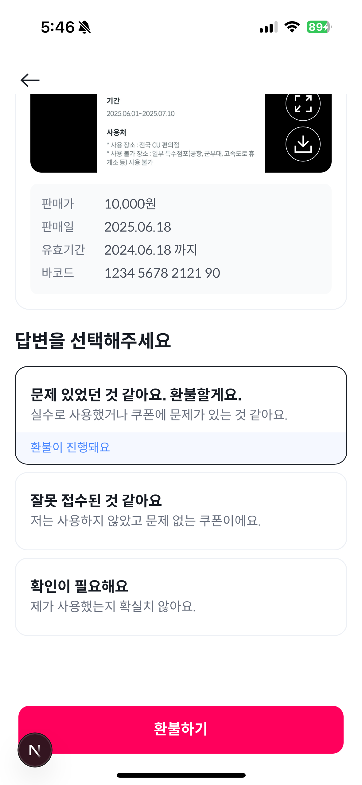

# 🎫 니콘내콘 기프티콘 문의 · 트러블 처리 웹뷰 (실무 프로젝트)

트러블 발생한 쿠폰 관련 문의 및 설명을 위한 사용자 화면 (25.7월 중 배포 예정)

---

## 📝 소개

**니콘내콘 트러블 웹뷰**은 니콘내콘 기프티콘 사용 중 발생한 이슈(트러블)를 유저가 확인하고  
처리 요청을 할 수 있도록 구성된 트러블 전용 UI 화면입니다.  
Next.js 기반의 CSR/SSR 혼합 구조로 설계되었으며, 웹뷰 및 앱 내 연동을 고려해 구성되었습니다.

---

## 🛠️ 기술 스펙

| 항목                   | 내용                                                             |
| ---------------------- | ---------------------------------------------------------------- |
| **설명**               | 기프티콘 이슈(트러블) 처리 화면                                  |
| **프레임워크**         | Next.js 15 (`App Router`, `SSR`, `Suspense`, `Hydration`)        |
| **언어**               | TypeScript                                                       |
| **스타일**             | Tailwind CSS 4                                                   |
| **상태관리**           | React Query, Jotai, Context                                      |
| **공용 컴포넌트 호출** | PortalContext를 활용한 전역 접근 방식 구현 (ex. Modal, Toast 등) |
| **통신**               | Axios                                                            |
| **웹뷰 연동**          | WebViewMessageProvider                                           |
| **디자인**             | 자사 디자인 시스템 활용                                          |
| **형상관리**           | Git + Husky + Lint-staged                                        |
| **코드 스타일**        | ESLint + Prettier                                                |
| **패키지 매니저**      | Yarn 4 (`Zero-Installs`, `Plug'n'Play`)                          |

---

## ✅ 적용 목적

- **유저 친화적인 트러블 응대 화면 제공**
- **React Query 기반 SSR 데이터 prefetch 처리**
- **유저 인증 쿠키 기반 조건 분기 처리**
- **재사용 가능한 디자인 시스템 연동**
- **웹뷰 & 앱 모두에서 대응 가능한 UI 구조 구성**

---

## 💡 주요 컴포넌트 및 기능

### ✅ Layout 구성

- SSR 환경에서 쿠키 기반 인증 처리 (`setAuth`)
- Provider 계층 구조: `ReactQueryProvider` → `Jotai` → `AxiosClientProvider`
- 모바일 앱 환경을 고려한 `WebViewMessageProvider` 포함

### 🧱 페이지 구성

- `HydrationBoundary`: SSR + React Query 상태 동기화 처리
- `Suspense` + `Loading`: Fallback UI 처리
- `error`, `not-found`: 예외 처리 페이지

---
