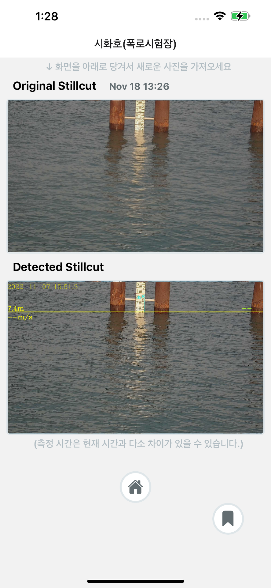

<h1 align="center">[React Native]wateraiInfo<br/>(iOS & Android)</h1>
<h1 align="center">(iOS & Android)</h1>

<div align="center">
  <br />
  <blockquote><b>The Information App that provide users detected water level.</b></blockquote>
  <pre align="center">App Store: <a href="https://apps.apple.com/kr/app/wateraiinfo/id6444245568">wateraiInfo</a><br/>Google Play Store: <a href="https://play.google.com/store/apps/details?id=com.wateraiinfo">wateraiInfo</a></pre>
</div>

<br/>

<div align="center">
  
  
  
  <br />
</div>

### Features

* Photo, Video and Snapshot capture
* Customizable devices and multi-cameras (smoothly zoom out to "fish-eye" camera)
* Customizable FPS
* [Frame Processors](https://mrousavy.github.io/react-native-vision-camera/docs/guides/frame-processors) (JS worklets to run QR-Code scanning, facial recognition, AI object detection, realtime video chats, ...)
* Smooth zooming (Reanimated)
* Fast pause and resume
* HDR & Night modes

> See the [example](./example/) app

### Example

```tsx
function App() {
  const devices = useCameraDevices('wide-angle-camera')
  const device = devices.back

  if (device == null) return <LoadingView />
  return (
    <Camera
      style={StyleSheet.absoluteFill}
      device={device}
      isActive={true}
    />
  )
}
```

### Adopting at scale

<a href="https://github.com/sponsors/mrousavy">
  
</a>

VisionCamera is provided _as is_, I work on it in my free time.

If you're integrating VisionCamera in a production app, consider [funding this project](https://github.com/sponsors/mrousavy) and <a href="mailto:me@mrousavy.com?subject=Adopting VisionCamera at scale">contact me</a> to receive premium enterprise support, help with issues, prioritize bugfixes, request features, help at integrating VisionCamera and/or Frame Processors, and more.

<br />

#### 🚀 Get started by [setting up permissions](https://mrousavy.github.io/react-native-vision-camera/docs/guides/)!
