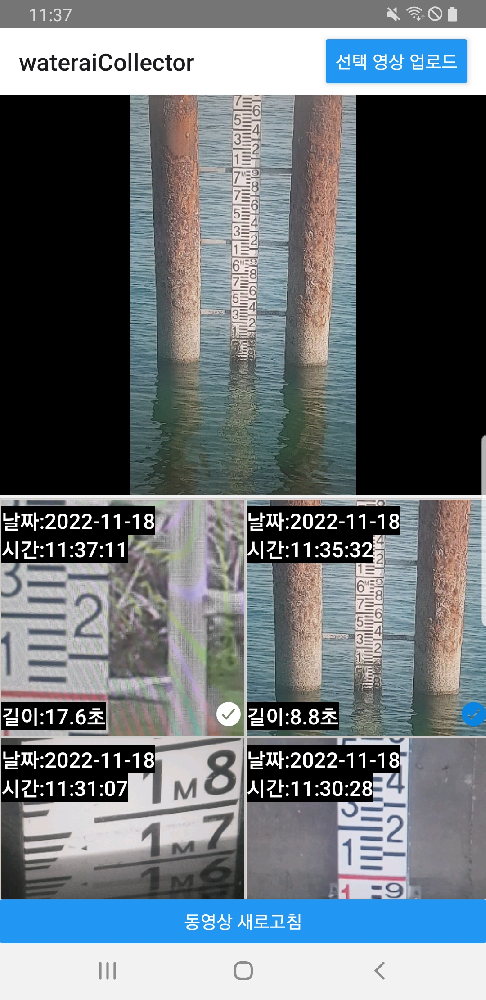

<h1 align="center">[React Native] File Upload App </h1>

   
  <blockquote><b>The Information App that provide users to upload the selected file and data, transfer inside the form.</b></blockquote>

 

  
  
   

