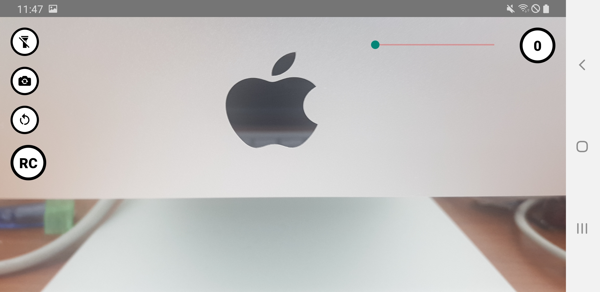
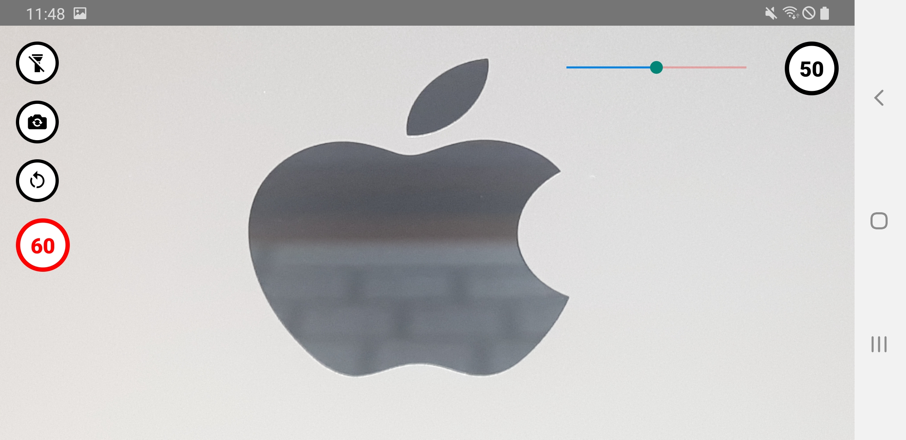

<h1 align="center">[React Native] Auto Recording App (2022) </h1>

   
  <blockquote><b>An App that can replace the CCTV.</b></blockquote>

 

  
  
   

### Features

* device location, react-native-device-info, camera, auto & loop recording.
* can change the value of response data from server such as zoom, duration value.
