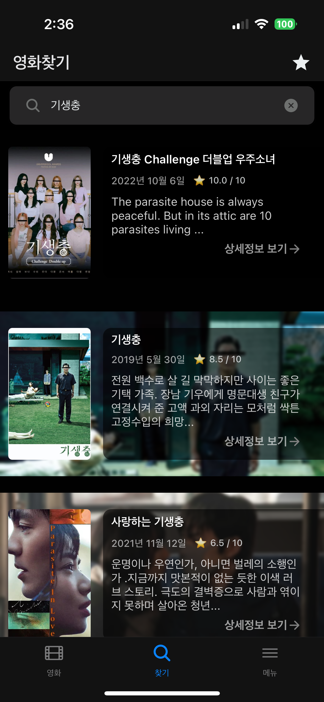
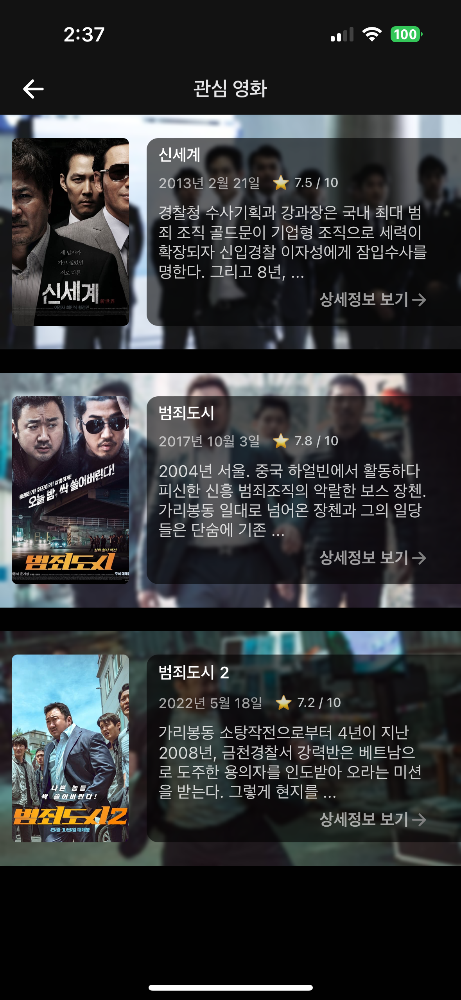

# Portfolio_WorldMovie
<h1 align="center">[React Native] 월드무비 (2023) </h1>
<h2 align="center">(iOS & Android)</h2>

   
  <blockquote><b>The Movie Information App that provide users to add movie to their list.</b></blockquote>
  <blockquote><b>프로젝트에 직접적인 영향을 주는 중요한 코드는 삭제했습니다.</b></blockquote>
  <pre align="center">App Store: <a href="https://apps.apple.com/kr/app/%EC%9B%94%EB%93%9C%EB%AC%B4%EB%B9%84/id6473882514">월드무비</a> </pre>

 

  
  
  
  
   

 

### Features

- AuthContext를 활용한 사용자 경험 관리와 로그인 프로세스 구현, 에러 처리, 그리고 비밀번호 변경 및 회원
탈퇴와 같은 보안 기능을 개발하고, Firebase를 사용하여 사용자 데이터 관리. 
- Promise와 async-await를 사용한 안정적인 API 통신 및 비동기 작업의 예외 처리에 능숙하며, Zustand를
활용하여 애플리케이션의 성능과 유지보수성을 극대화. 
- TypeScript를 사용한 정확한 타입 정의로 안정적이고 유지보수가 용이한 코드베이스 구축. 
- 영화 API와 Firebase의 적절한 조합으로 클라이언트 작성 만으로 서비스 배포.
